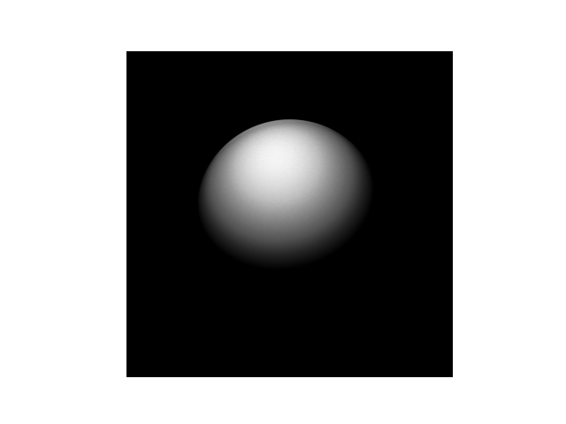

 ### IMAGE: ```1000 x 1000 grid and 1,000,000,000 rays```
 
## **COMPILE AND RUN** 
* SERIAL
  * ```make serial```
  * ```./serial <grid_size> <num_of_rays>```
* CUDA
  * ```make cuda```
  * ```./cuda <grid_size> <num_of_rays> <num_threads_per_block>```
## **OPTIMAL SETTINGS ON THE GPU** 
* GRID_D: 1,000 N_RAYS: 1,000,000,000
* BLOCKS: 65535 THREADS PER BLOCK: 32
* time elapsed: 1.235815(s)
* BLOCKS: 65535 THREADS PER BLOCK: 64
* time elapsed: 1.228932(s)
* BLOCKS: 65535 THREADS PER BLOCK: 128
* time elapsed: 1.202047(s)
* BLOCKS: 65535 THREADS PER BLOCK: 256
* time elapsed: 1.201033(s)

### The optimal setting was with 256 threads per block
</br>

### **TIME COMPARISON as a function of NUMBER OF RAYS**

 |         #Rays | TIME (s) serial | TIME (s) CUDA |
 | ------------: | --------------: | ------------: |
 |        10,000 |        0.004454 |      0.000092 |
 |       100,000 |        0.043513 |     0.0001999 |
 |     1,000,000 |        0.419113 |      0.001409 |
 |    10,000,000 |        4.183725 |      0.013441 |
 |   100,000,000 |       41.865421 |      0.134746 |
 | 1,000,000,000 |      420.276577 |      1.200679 |
